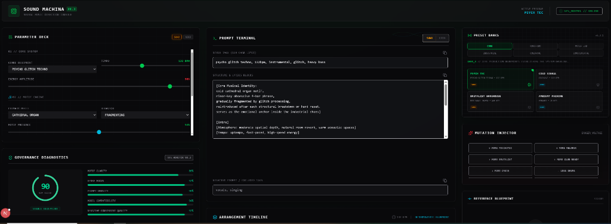

# Sound Machina



> Neural Music Direction Console

Sound Machina is a deterministic control plane for AI music composition, combining prompt generation, motif engineering, version control, diagnostics, and blueprint lineage.

Instead of manually writing prompts, operators build structured musical blueprints, analyze composition quality, track creative evolution, compare versions, and restore previous states through a TM4-inspired governance workflow.

---

## Vision

Most AI music tools operate as one-time prompt generators:

Prompt → Generate → Lose History

Sound Machina introduces a reproducible engineering workflow:

Blueprint → Generate → Snapshot → Compare → Restore → Iterate

The goal is to bring version control, governance, diagnostics, and reproducibility to AI-assisted music creation.

---

## Core Concepts

### Composition Blueprint

Every track is represented as a structured blueprint rather than a free-form prompt.

Example:

```json
{
  "genre": "psycho_glitch_techno",
  "bpm": 132,
  "energy": 90,
  "motif_type": "cathedral organ",
  "motif_presence": 50,
  "motif_behavior": "fragmenting",
  "harmony_mode": "minor",
  "bass_aggression": 85,
  "glitch_density": 95
}
```

### Motif Engine

The Motif Engine creates the musical identity layer of a composition.

Examples:

* Cathedral Organ
* Piano Psychosis
* FM Signal
* Bell Machine
* Choir Protocol
* Guitar Mutation

Unlike traditional prompt systems, Sound Machina treats motif design as a first-class composition primitive.

### Governance Diagnostics

Every blueprint is analyzed through deterministic scoring systems:

* Motif Clarity
* Genre Focus
* Prompt Density
* Model Compatibility
* Negative Constraint Quality

Operators receive optimization guidance before exporting prompts.

### Blueprint Registry

Every generation automatically creates a versioned snapshot.

Example:

```text
PSYCH_TEC_0001
PSYCH_TEC_0002
PSYCH_TEC_0003
```

Snapshots can be:

* Restored
* Compared
* Used as calibration baselines
* Tracked through drift analysis

### Blueprint Drift Score

Sound Machina measures creative deviation between blueprint versions.

```text
0-10%   Nearly Identical
10-25%  Minor Variation
25-50%  Significant Mutation
50%+    New Blueprint
```

---

## Architecture

### Composition Engine

Converts operator controls into a normalized Composition Blueprint.

Responsibilities:

* Genre definition
* Tempo management
* Harmony modeling
* Motif generation
* Atmosphere modeling
* Energy mapping

### Prompt Engine

Transforms blueprints into platform-specific prompt structures.

Supported Targets:

* Suno
* Udio

Future Targets:

* Stable Audio
* MusicGen
* ACE Studio
* Additional generative music systems

### Export Engine

Responsible for:

* Prompt export
* JSON project export
* Snapshot serialization
* Blueprint restoration

---

## Preset Banks

### BANK_A — Core

* Psych Tec
* Cold Signal
* Brutalist Warehouse
* Ambient Machine

### BANK_B — RokoRobo Signature Collection

* Velvet Dream
* Hi Def Love
* Under Hypnosis
* Pink Lady
* Dark Disco
* Skillbot Rap
* Sistema Acceso

### BANK_C — Motif Laboratory

* Organ Collapse
* Piano Psychosis
* FM Signal
* Bell Machine
* Choir Protocol
* Guitar Mutation

### BANK_D — Industrial Systems

* Berghain Pressure
* Concrete Hall
* Steel Beam
* Machine Ritual
* Ultra Industrial
* Factory Ghost

### BANK_E — Coldwave / Minimal Wave

* Static Heart
* Cold Neon
* Lucy Protocol
* Ghost Signal
* Velvet Delay
* No Return State

### BANK_F — Experimental AI

* Neural Collapse
* Fractal Object
* Synthetic Memory
* Digital Archaeology
* Electronica Ultima
* Machine Dream

---

## Technology Stack

### Frontend

* Next.js
* React
* Tailwind CSS
* Zustand
* Framer Motion

### Backend

* FastAPI
* SQLAlchemy
* SQLite
* Pydantic

---

## Current Release

### v0.3.1

Implemented:

* Composition Engine
* Prompt Engine
* Export Engine
* Motif Intelligence
* Arrangement Timeline
* Governance Diagnostics
* Optimization Advisor
* Blueprint Registry
* Calibration Baseline System
* Blueprint Drift Score
* Multi-Bank Preset Architecture

---

## Roadmap

### v0.4 — Blueprint Intelligence Layer

Planned:

* Lineage Engine
* Evolution Analysis
* Parameter Drift Analytics
* Creative Branching
* Blueprint Forking
* Composition Evolution Tracking

---

## Design Philosophy

Sound Machina follows the same deterministic engineering principles used throughout the TM4 ecosystem:

* Reproducibility
* Auditability
* Traceability
* Version Control
* Operator Governance

The objective is simple:

Transform AI music generation from prompt experimentation into a structured composition engineering workflow.

---

## License

MIT License
